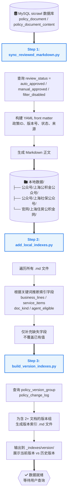
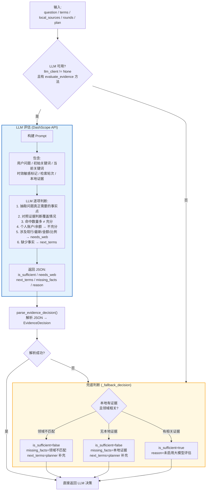
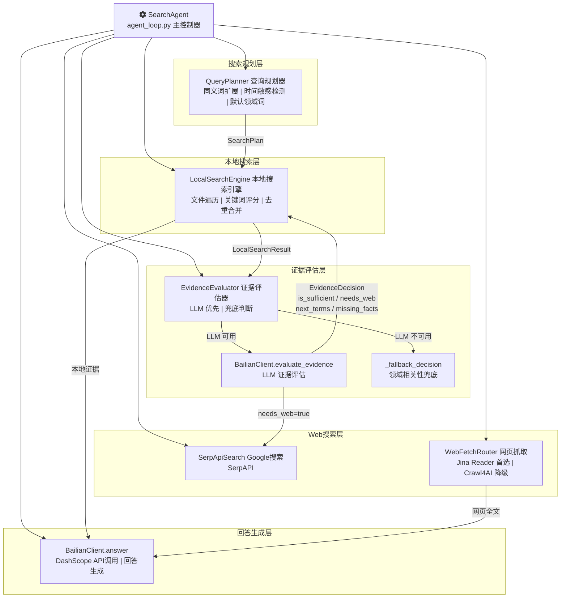
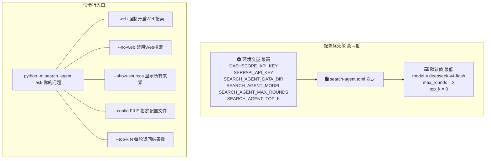

# 资料库关键词搜索 Agent — 项目流程图

---

## 一、数据同步流程（离线，定期执行）

```mermaid
flowchart TD
    A[("fa:fa-database MySQL sicrawl 数据库<br>policy_document / policy_document_content")]

    A ==> H1["Step 1: sync_reviewed_markdown.py"]
    H1 ~~~ B1["查询 review_status =<br>auto_approved / manual_approved / filter_disabled"]
    B1 --> B2["构建 YAML front matter<br>政策ID、版本号、状态、来源"]
    B2 --> B3["生成 Markdown 正文"]

    B3 ==> C[("fa:fa-folder 本地数据/<br>├── 公众号/上海公积金公众号/<br>├── 公众号/上海社保公众号/<br>└── 官网/上海住房公积金网/")]

    C ==> H2["Step 2: add_local_indexes.py"]
    H2 ~~~ D1["遍历所有 .md 文件"]
    D1 --> D2["根据关键词推断索引字段<br>business_lines / service_items<br>doc_kind / agent_eligible"]
    D2 --> D3["仅补充缺失字段<br>不覆盖已有值"]

    D3 ==> H3["Step 3: build_version_indexes.py"]
    H3 ~~~ E1["查询 policy_version_group<br>policy_change_log"]
    E1 --> E2["为含 2+ 文档的版本组<br>生成版本索引 .md 文件"]
    E2 --> E3["输出到 _indexes/version/<br>展示当前版本 vs 历史版本"]

    E3 ==> F{{"fa:fa-check 数据就绪<br>等待用户查询"}}

    style H1 fill:#e8f4fd,stroke:#1a73e8,stroke-width:2px,color:#1a73e8,font-weight:bold
    style H2 fill:#e8f4fd,stroke:#1a73e8,stroke-width:2px,color:#1a73e8,font-weight:bold
    style H3 fill:#e8f4fd,stroke:#1a73e8,stroke-width:2px,color:#1a73e8,font-weight:bold
```

---

## 二、查询流程（在线，用户触发）

```mermaid
flowchart TD
    User(("fa:fa-user 用户输入问题<br>例: 上海公积金如何缴存"))

    User ==> H1["Step 1: 查询规划 QueryPlanner"]
    H1 ~~~ P1["分词 + 同义词扩展 + 领域默认词"]
    P1 --> P2["示例:<br>公积金 → 住房公积金/缴存/存储<br>社保 → 社会保险/参保/养老保险<br>默认追加 → 上海"]
    P2 --> P3["时间敏感检测<br>最新/今年/比例"]

    P3 --> Plan["SearchPlan<br>terms, needs_web"]

    Plan ==> H2["Step 2: 多轮本地搜索循环 最多3轮"]
    H2 ~~~ S1["当前搜索词 terms"]
    S1 --> S2["LocalSearchEngine.search()<br>遍历 .md 文件，多维度评分:<br>文件路径×8 | 标题×10 | 元数据×7<br>正文×min(count,5)×2<br>额外加权: 现行有效+12 | 年份匹配+80"]
    S2 --> S3["merge_local_sources()<br>去重合并"]

    S3 ==> H2E["证据评估 EvidenceEvaluator"]
    H2E ~~~ E1{"LLM 可用?"}
    E1 -- "是" --> E2["LLM 评估 (evaluate_evidence)<br>抽取问题事实点<br>对照证据判断覆盖情况<br>返回 JSON 决策"]
    E1 -- "否" --> E3["兜底判断 (_fallback_decision)<br>仅检查领域相关性 + 证据是否存在"]
    E2 --> E4["decision:<br>is_sufficient / needs_web<br>next_terms / missing_facts"]
    E3 --> E4

    E4 --> S5{"is_sufficient?"}
    S5 -- "是" --> Done["跳出循环"]
    S5 -- "否" --> S6{"next_terms 为空<br>或与本轮相同?"}
    S6 -- "是" --> Done
    S6 -- "否" --> S7["terms = next_terms<br>由 LLM 生成下一轮搜索词"]
    S7 -.-> S1

    Done ==> H3["Step 3: Web 搜索 条件触发"]
    H3 ~~~ W1{"should_use_web()"}
    W1 -- "auto<br>needs_web=true<br>或本地不足2条" --> W2
    W1 -- "always --web" --> W2
    W1 -- "never --no-web" --> W5["跳过"]
    W2["SerpApiSearch.search()<br>Google 有机搜索结果"] --> W3a
    W3a["Jina Reader 首选/快速"] --> W3c["质量检查:<br>不足500字/错误页/缺少关键术语 → 拒绝<br>PDF → pdf_unsupported"]
    W3a -- "质量不达标" --> W3b["Crawl4AI 降级/无头浏览器"]
    W3b --> W3c

    W3c ==> H4["Step 4: 最终回答生成"]
    H4 ~~~ F1["rank_final_sources()<br>2025年度+100 | 官方+30 | 过期-30"]
    F1 --> F2["filter_final_sources()<br>优先筛选最新年度文档"]
    F2 --> F3["BailianClient.answer()"]
    F3 --> F4["构建 Prompt<br>问题 + 本地证据 + Web结果 + 网页全文"]
    F4 --> F5["调用 DashScope API<br>DeepSeek 模型 temperature=0.2"]
    F5 --> F6["输出: 中文回答 + 来源引用"]

    F6 ==> Output{{"AgentAnswer<br>answer / local_sources / web_sources<br>web_pages / search_rounds / used_web<br>answerable / unable_reason"}}

    style H1 fill:#e8f4fd,stroke:#1a73e8,stroke-width:2px,color:#1a73e8,font-weight:bold
    style H2 fill:#e8f4fd,stroke:#1a73e8,stroke-width:2px,color:#1a73e8,font-weight:bold
    style H2E fill:#fff3e0,stroke:#e65100,stroke-width:2px,color:#e65100,font-weight:bold
    style H3 fill:#e8f4fd,stroke:#1a73e8,stroke-width:2px,color:#1a73e8,font-weight:bold
    style H4 fill:#e8f4fd,stroke:#1a73e8,stroke-width:2px,color:#1a73e8,font-weight:bold
```

---

## 三、证据评估详细逻辑

```mermaid
flowchart TD
    Input["输入:<br>question / terms / local_sources / rounds / plan"]

    Input --> Check{"LLM 可用?<br>llm_client != None<br>且有 evaluate_evidence 方法"}

    Check -- "是" --> LLM["调用 LLM evaluate_evidence()"]

    subgraph LLM["LLM 评估 (DashScope API)"]
        L1["构建 Prompt"]
        L1 --> L2["包含:<br>用户问题 / 初始关键词 / 当前关键词<br>时效敏感标记 / 检索轮次 / 本地证据"]
        L2 --> L3["LLM 逐项判断:<br>1. 抽取问题真正需要的事实点<br>2. 对照证据判断覆盖情况<br>3. 命中数量多 ≠ 充分<br>4. 个人账户/余额 → 不充分<br>5. 涉及现行/最新/金额/比例 → needs_web<br>6. 缺少事实 → next_terms"]
        L3 --> L4["返回 JSON:<br>is_sufficient / needs_web<br>next_terms / missing_facts / reason"]
    end

    L4 --> Parse["parse_evidence_decision()<br>解析 JSON → EvidenceDecision"]
    Parse --> Success{"解析成功?"}
    Success -- "是" --> Return["直接返回 LLM 决策"]
    Success -- "否" --> Fallback

    Check -- "否" --> Fallback

    subgraph Fallback["兜底判断 (_fallback_decision)"]
        F1{"本地有证据<br>且领域相关?"}
        F1 -- "领域不匹配" --> F2["is_sufficient=false<br>missing_facts=领域不匹配<br>next_terms=planner 补充"]
        F1 -- "无本地证据" --> F3["is_sufficient=false<br>missing_facts=本地证据<br>next_terms=planner 补充"]
        F1 -- "有相关证据" --> F4["is_sufficient=true<br>reason=未启用大模型评估"]
    end

    F2 --> Return
    F3 --> Return
    F4 --> Return

    style LLM fill:#e3f2fd,stroke:#1565c0,stroke-width:2px
    style Fallback fill:#fff8e1,stroke:#f9a825,stroke-width:2px
```

---

## 四、核心模块关系图

```mermaid
graph TB
    Agent["fa:fa-cog SearchAgent<br>agent_loop.py 主控制器"]

    subgraph 搜索规划层
        QP["QueryPlanner 查询规划器<br>同义词扩展 | 时间敏感检测 | 默认领域词"]
    end

    subgraph 本地搜索层
        LS["LocalSearchEngine 本地搜索引擎<br>文件遍历 | 关键词评分 | 去重合并"]
    end

    subgraph 证据评估层
        EE["EvidenceEvaluator 证据评估器<br>LLM 优先 | 兜底判断"]
        LLM["BailianClient.evaluate_evidence<br>LLM 证据评估"]
        FB["_fallback_decision<br>领域相关性兜底"]
    end

    subgraph Web搜索层
        SP["SerpApiSearch Google搜索<br>SerpAPI"]
        WF["WebFetchRouter 网页抓取<br>Jina Reader 首选 | Crawl4AI 降级"]
    end

    subgraph 回答生成层
        BC["BailianClient.answer<br>DashScope API调用 | 回答生成"]
    end

    Agent --> QP
    Agent --> LS
    Agent --> EE
    Agent --> SP
    Agent --> WF
    Agent --> BC

    EE -->|"LLM 可用"| LLM
    EE -->|"LLM 不可用"| FB

    QP -->|"SearchPlan"| LS
    LS -->|"LocalSearchResult"| EE
    LLM -->|"EvidenceDecision<br>is_sufficient / needs_web<br>next_terms / missing_facts"| LS
    LLM -->|"needs_web=true"| SP
    LS -->|"本地证据"| BC
    WF -->|"网页全文"| BC
```

---

## 五、配置与运行方式

```mermaid
flowchart TD
    subgraph Config["配置优先级 高→低"]
        C1["fa:fa-cog 环境变量 最高<br>DASHSCOPE_API_KEY<br>SERPAPI_API_KEY<br>SEARCH_AGENT_DATA_DIR<br>SEARCH_AGENT_MODEL<br>SEARCH_AGENT_MAX_ROUNDS<br>SEARCH_AGENT_TOP_K"]
        C2["fa:fa-file search-agent.toml 次之"]
        C3["fa:fa-sliders 默认值 最低<br>model = deepseek-v4-flash<br>max_rounds = 3<br>top_k = 8"]
        C1 --> C2 --> C3
    end

    subgraph CLI["命令行入口"]
        CL1["python -m search_agent ask 你的问题"]
        CL2["--web          强制开启Web搜索"]
        CL3["--no-web       禁用Web搜索"]
        CL4["--show-sources 显示所有来源"]
        CL5["--config FILE  指定配置文件"]
        CL6["--top-k N      每轮返回结果数"]
        CL1 --- CL2
        CL1 --- CL3
        CL1 --- CL4
        CL1 --- CL5
        CL1 --- CL6
    end
```
