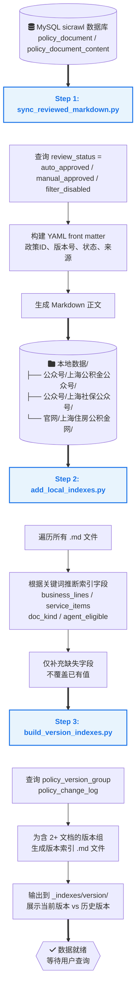
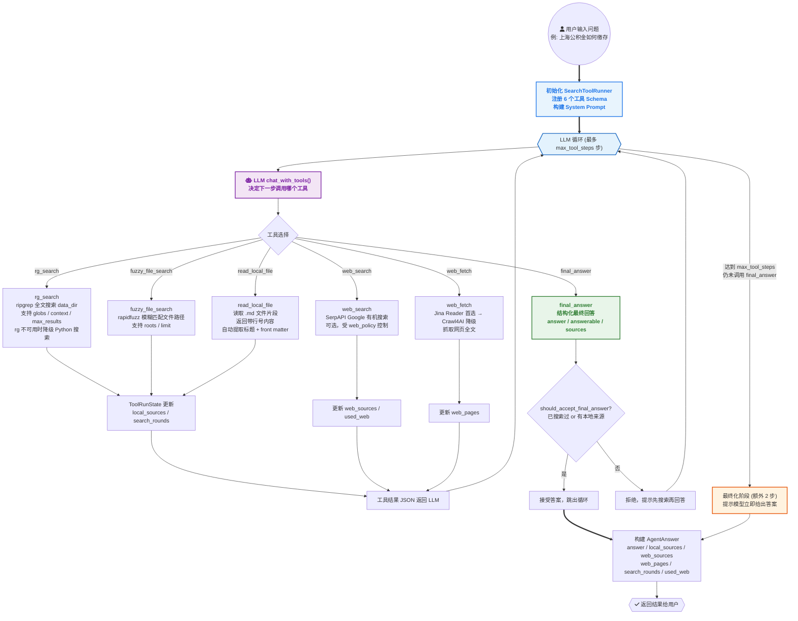
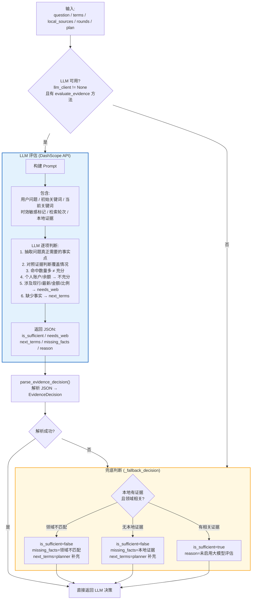
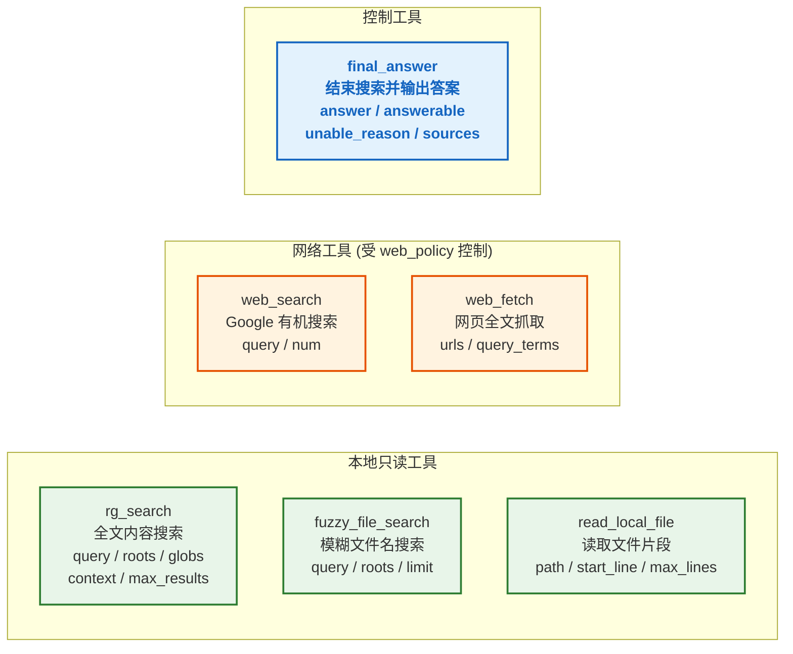
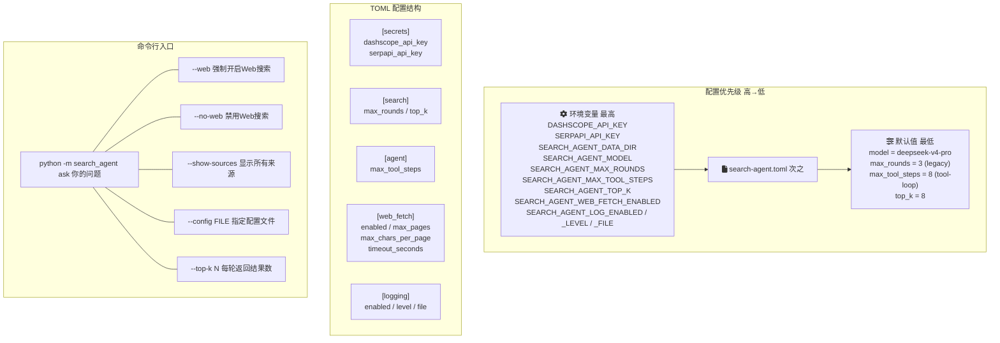
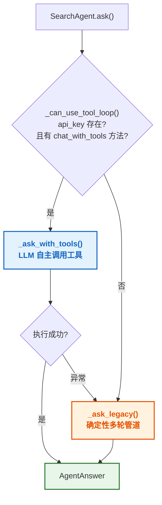

# 资料库关键词搜索 Agent — 项目流程图

---

## 一、数据同步流程（离线，定期执行）

---

## 二、查询流程 — Tool-Calling Loop（主模式）

> 有 API Key 时自动启用，LLM 自主决定调用哪个工具，循环最多 `max_tool_steps` 步。

---

## 三、查询流程 — Legacy Loop（降级模式）

> 无 API Key 或 tool-calling 失败时自动降级。确定性多轮搜索管道。

```mermaid
flowchart TD
    User(("fa:fa-user 用户输入问题<br>例: 上海公积金如何缴存"))

    User ==> H1["Step 1: 查询规划 QueryPlanner"]
    H1 ~~~ P1["分词 + 同义词扩展 + 领域默认词"]
    P1 --> P2["示例:<br>公积金 → 住房公积金/缴存/存储<br>社保 → 社会保险/参保/养老保险<br>默认追加 → 上海"]
    P2 --> P3["时间敏感检测<br>最新/今年/比例"]

    P3 --> Plan["SearchPlan<br>terms, needs_web"]

    Plan ==> H2["Step 2: 多轮本地搜索循环 最多3轮"]
    H2 ~~~ S1["当前搜索词 terms"]
    S1 --> S2["LocalSearchEngine.search()<br>遍历 .md 文件，多维度评分:<br>文件路径×8 | 标题×10 | 元数据×7<br>正文×min(count,5)×2<br>额外加权: 现行有效+12 | 年份匹配+80"]
    S2 --> S3["merge_local_sources()<br>去重合并"]

    S3 ==> H2E["证据评估 EvidenceEvaluator"]
    H2E ~~~ E1{"LLM 可用?"}
    E1 -- "是" --> E2["LLM 评估 (evaluate_evidence)<br>抽取问题事实点<br>对照证据判断覆盖情况<br>返回 JSON 决策"]
    E1 -- "否" --> E3["兜底判断 (_fallback_decision)<br>仅检查领域相关性 + 证据是否存在"]
    E2 --> E4["decision:<br>is_sufficient / needs_web<br>next_terms / missing_facts"]
    E3 --> E4

    E4 --> S5{"is_sufficient?"}
    S5 -- "是" --> Done["跳出循环"]
    S5 -- "否" --> S6{"next_terms 为空<br>或与本轮相同?"}
    S6 -- "是" --> Done
    S6 -- "否" --> S7["terms = next_terms<br>由 LLM 生成下一轮搜索词"]
    S7 -.-> S1

    Done ==> H3["Step 3: Web 搜索 条件触发"]
    H3 ~~~ W1{"should_use_web()"}
    W1 -- "auto<br>needs_web=true<br>或本地不足2条" --> W2
    W1 -- "always --web" --> W2
    W1 -- "never --no-web" --> W5["跳过"]
    W2["SerpApiSearch.search()<br>Google 有机搜索结果"] --> W3a
    W3a["Jina Reader 首选/快速"] --> W3c["质量检查:<br>不足500字/错误页/缺少关键术语 → 拒绝<br>PDF → pdf_unsupported"]
    W3a -- "质量不达标" --> W3b["Crawl4AI 降级/无头浏览器"]
    W3b --> W3c

    W3c ==> H4["Step 4: 最终回答生成"]
    H4 ~~~ F1["rank_final_sources()<br>领域匹配+40 | 事项匹配+18 | 年份匹配+80<br>现行有效+30 | 过期-30 | 官方来源+20"]
    F1 --> F2["filter_final_sources()<br>移除领域错配 | 优先最新年份"]
    F2 --> F3["BailianClient.answer()"]
    F3 --> F4["构建 Prompt<br>问题 + 本地证据 + Web结果 + 网页全文"]
    F4 --> F5["调用 DashScope API<br>DeepSeek 模型 temperature=0.2"]
    F5 --> F6["输出: 中文回答 + 来源引用"]

    F6 ==> Output{{"AgentAnswer<br>answer / local_sources / web_sources<br>web_pages / search_rounds / used_web<br>answerable / unable_reason"}}

    style H1 fill:#e8f4fd,stroke:#1a73e8,stroke-width:2px,color:#1a73e8,font-weight:bold
    style H2 fill:#e8f4fd,stroke:#1a73e8,stroke-width:2px,color:#1a73e8,font-weight:bold
    style H2E fill:#fff3e0,stroke:#e65100,stroke-width:2px,color:#e65100,font-weight:bold
    style H3 fill:#e8f4fd,stroke:#1a73e8,stroke-width:2px,color:#1a73e8,font-weight:bold
    style H4 fill:#e8f4fd,stroke:#1a73e8,stroke-width:2px,color:#1a73e8,font-weight:bold
```

---

## 四、证据评估详细逻辑（Legacy 模式使用）

---

## 五、核心模块关系图

```mermaid
graph TB
    CLI["fa:fa-terminal CLI 入口<br>__main__.py → cli.py"]

    CLI --> Agent["fa:fa-cog SearchAgent<br>agent_loop.py 主控制器"]

    Agent -->|"有 API Key<br>_can_use_tool_loop()"| ToolMode["Tool-Calling Loop<br>_ask_with_tools()"]
    Agent -->|"无 API Key 或异常<br>降级"| LegacyMode["Legacy Loop<br>_ask_legacy()"]

    subgraph 工具调用模式
        ToolMode --> TR["SearchToolRunner<br>tools.py 工具调度器"]
        TR --> RG["rg_search<br>ripgrep / Python 全文搜索"]
        TR --> FUZZ["fuzzy_file_search<br>rapidfuzz 模糊匹配"]
        TR --> READ["read_local_file<br>读取 .md 文件"]
        TR --> WS_T["web_search<br>SerpAPI"]
        TR --> WF_T["web_fetch<br>Jina / Crawl4AI"]
        TR --> FA["final_answer<br>结束循环"]
        ToolMode --> LLM_T["BailianClient.chat_with_tools<br>LLM 自主决策工具调用"]
    end

    subgraph 确定性管道模式
        LegacyMode --> QP["QueryPlanner 查询规划器<br>同义词扩展 | 时间敏感检测 | 默认领域词"]
        LegacyMode --> LS["LocalSearchEngine 本地搜索引擎<br>文件遍历 | 关键词评分 | 去重合并"]
        LegacyMode --> EE["EvidenceEvaluator 证据评估器<br>LLM 优先 | 兜底判断"]
        LegacyMode --> WS_L["SerpApiSearch Google搜索"]
        LegacyMode --> WF_L["WebFetchRouter 网页抓取<br>Jina Reader 首选 | Crawl4AI 降级"]
        LegacyMode --> BC["BailianClient.answer<br>DashScope API调用 | 回答生成"]
        EE -->|"LLM 可用"| LLM_E["BailianClient.evaluate_evidence"]
        EE -->|"LLM 不可用"| FB["_fallback_decision<br>领域相关性兜底"]
    end

    subgraph 共享模块
        REL["relevance.py<br>领域关键词 | 服务事项<br>年份检测 | 来源权威性评分"]
        MOD["models.py<br>SearchPlan / LocalSearchResult<br>WebSearchResult / EvidenceDecision<br>AgentAnswer / SearchRound"]
        CFG["config.py<br>Settings (TOML + 环境变量)"]
        LOG["logging_config.py<br>旋转日志文件"]
    end

    Agent -.-> REL
    Agent -.-> MOD
    Agent -.-> CFG
    Agent -.-> LOG
    TR -.-> MOD
    LS -.-> MOD

    style CLI fill:#f5f5f5,stroke:#616161,stroke-width:2px
    style Agent fill:#e8f4fd,stroke:#1a73e8,stroke-width:2px,color:#1a73e8,font-weight:bold
    style ToolMode fill:#e3f2fd,stroke:#1565c0,stroke-width:2px,color:#1565c0,font-weight:bold
    style LegacyMode fill:#fff3e0,stroke:#e65100,stroke-width:2px,color:#e65100,font-weight:bold
    style LLM_T fill:#f3e5f5,stroke:#7b1fa2,stroke-width:2px
    style LLM_E fill:#f3e5f5,stroke:#7b1fa2,stroke-width:2px
```

---

## 六、Tool-Calling 工具清单

---

## 七、配置与运行方式

---

## 八、模式选择决策流程

